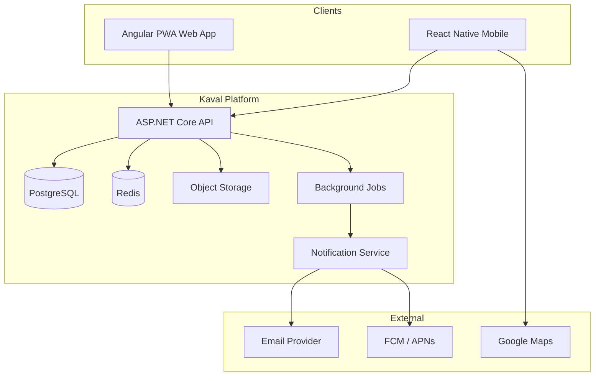

# Architecture Decision Document — Kaval Online

## 1. Executive Summary

Kaval Online is a **cloud-first, multi-tenant NGO case management platform** with:

- **Web app** (Project Director, Project Coordinator) — **Angular PWA** (installable supervisor client)
- **Mobile app** (Social Worker, Case Worker) — **React Native** (iOS + Android)
- **Central API** — ASP.NET Core 8 REST API, PostgreSQL, object storage for attachments
- **Real-time supervisor visibility** — no Excel sync; optional brief offline on mobile with explicit sync queue

This document is the technical contract for AI agents implementing Midi-Kaval. Product contract: `SPEC.md`. UX contract: `DESIGN.md` + `EXPERIENCE.md`.

## 2. Project Context Analysis

### 2.1 Scale & complexity

| Dimension | Assessment |
|-----------|------------|
| Functional requirements | 28 FRs (v1), AI deferred v1.1/v2 |
| Surfaces | 2 clients + 1 API |
| Roles | 5 RBAC roles, server-enforced |
| Domain | Social work / juvenile justice — POCSO-sensitive data |
| Real-time | Dashboard/queue freshness ~60s; visit completion near-real-time |
| Offline | Mobile visit/notes buffer only; cloud is source of truth |
| Integrations v1 | Email, push (FCM/APNs), Google Maps — no court/police APIs |

### 2.2 Architectural drivers (from PRD + UX)

1. **Server-side RBAC** — never trust client role UI (FR-2).
2. **Unique Crime/ST + duplicate prevention** — DB constraints + pre-save API check (FR-4, FR-5).
3. **Audit trail** — all mutations logged (FR-25).
4. **Crisis Queue / Command Strip** — API must support prioritized supervisor queries and field today-queue.
5. **Court miss escalation** — scheduled job + notification pipeline (FR-17).
6. **Attachment security** — receipts, note files via signed URLs, role-scoped (FR-13, FR-18).
7. **POCSO discreet capture** — field flag on case classification; minimal PII in mobile list APIs when discreet mode active.

### 2.3 Cross-cutting concerns

- Authentication (email/password + OTP 2FA)
- Multi-tenancy (organisation / NGO unit) `[ASSUMPTION: single org v1 pilot; schema tenant-ready]`
- Notifications (push, email; SMS/WhatsApp v1.1)
- Reporting (Excel/PDF export server-side)
- Future: Field Memory AI (v1.1) — separate read model / analytics schema

## 3. Starter & Repository Strategy

**Decision:** Monorepo `Midi-Kaval` with three deployable apps and shared packages.

| Rationale | Detail |
|-----------|--------|
| Single API contract | Web + mobile share OpenAPI-generated clients |
| Consistent RBAC | One authorization layer |
| Greenfield | No legacy code in repo |

**Stack selection** (confirmed by product owner):

| Layer | Choice | Version target |
|-------|--------|----------------|
| API | ASP.NET Core | 8.x LTS |
| ORM | Entity Framework Core | 8.x |
| Database | PostgreSQL | 16+ |
| Web | Angular + PWA (`@angular/service-worker`) + Angular Material | 19+ |
| Mobile | React Native | 0.76+ |
| Object storage | Azure Blob Storage (or S3-compatible) | — |
| Cache | Redis | 7.x (sessions, queue counts, rate limits) |
| Push | FCM + APNs via unified notification service | — |
| Email | SMTP or SendGrid | — |
| Maps | Google Maps SDK (mobile) / Maps JS (web) | — |

## 4. System Context



## 5. Core Architectural Decisions

### 5.1 Data architecture

**PostgreSQL** relational model — case-centric aggregate with related entities.

**Core aggregates:**

| Aggregate | Root entity | Key children |
|-----------|-------------|--------------|
| Case | `cases` | stages, visits, notes, interventions, court_sittings, assignments |
| TravelClaim | `travel_claims` | line items, receipts |
| Staff | `users` | roles, unit assignment |
| Legends | `legend_*` tables | offence types, classifications, etc. |
| Audit | `audit_events` | append-only |

**Constraints:**

- `UNIQUE (organisation_id, crime_number)`, `UNIQUE (organisation_id, st_number)`
- Soft-delete cases only via Termination/Exclusion stage — no hard delete in v1

**Migrations:** EF Core migrations in `src/api`; seed Legends from admin UI post-deploy.

**Caching:** Redis for session tokens, Crisis Queue snapshot (TTL 30s), dashboard widget counts.

**Read models (v1.1):** `case_outcome_tags` + materialized view for Field Memory AI patterns — not in v1 schema.

### 5.2 Authentication & security

| Decision | Implementation |
|----------|----------------|
| Auth | JWT access token (15 min) + refresh token (httpOnly cookie web / secure storage mobile) |
| 2FA | Email OTP on login; TOTP deferred |
| RBAC | Policy-based authorization on every endpoint; roles: Director, Coordinator, SocialWorker, CaseWorker |
| Force logout | Token version on `users`; increment on role change / deactivation |
| API security | HTTPS only, rate limiting on auth endpoints, CORS allowlist for web origin |
| PII | Encrypt sensitive fields at rest for beneficiary contact `[ASSUMPTION: column-level or app-level encryption for POCSO cases]` |
| Attachments | Private blob container; SAS URLs expiring 15 min; role check before issue |

### 5.3 API design

**REST** JSON API, versioned prefix `/api/v1`.

**Conventions:**

- Resources: plural kebab-case (`/cases`, `/court-sittings`, `/travel-claims`)
- IDs: UUID v4 in URLs
- Timestamps: ISO 8601 UTC in JSON
- Errors: RFC 7807 Problem Details

**Response envelope:**

```json
{
  "data": { },
  "meta": { "requestId": "..." }
}
```

**Pagination:** `?page=1&pageSize=25` with `meta.totalCount`.

**Key endpoints (v1):**

| Area | Endpoints |
|------|-----------|
| Auth | `POST /auth/login`, `POST /auth/verify-otp`, `POST /auth/refresh`, `POST /auth/logout` |
| Cases | CRUD, `GET /cases/search`, `POST /cases/check-duplicate`, `POST /cases/{id}/merge` |
| Visits | `GET /visits/today`, `POST /visits/{id}/start`, `POST /visits/{id}/complete`, `POST /visits/{id}/reschedule` |
| Court | CRUD sittings, `GET /court-sittings/upcoming` |
| Crisis queue | `GET /supervisor/crisis-queue` (prioritized DTO) |
| Dashboard | `GET /supervisor/dashboard` |
| Travel | CRUD claims, `POST /travel-claims/{id}/submit`, `POST /travel-claims/{id}/approve` |
| Legends | CRUD per legend type |
| Reports | `POST /reports/{type}/export` → async job → download URL |
| Notifications | `GET /notifications`, `PATCH /notifications/{id}/read` |
| Sync (mobile) | `POST /sync/push` batch upload for offline queue |
| Audit | `GET /audit` (Director only) |

**OpenAPI:** Generated from API; clients generated to `packages/api-client` (TypeScript — consumed by Angular web and React Native).

### 5.4 Web PWA architecture

**Pattern:** Installable supervisor SPA with service-worker caching; **cloud remains source of truth** for all mutations.

| Layer | Technology |
|-------|------------|
| Framework | Angular 19+ standalone components, signals for local UI state |
| UI kit | Angular Material — semantic tokens mapped from `DESIGN.md` (replaces prior shadcn reference) |
| PWA | `@angular/service-worker`, `ngsw-config.json` |
| HTTP | Generated `packages/api-client` via Angular `HttpClient` interceptors (auth, errors) |
| Routing | Role-guarded feature routes (`Director`, `Coordinator`) |
| i18n | `@angular/localize` structure; English v1 |

**PWA offline scope (v1 — bounded):**

| Cached | Strategy | Notes |
|--------|----------|-------|
| App shell, static assets | `prefetch` | Fast repeat loads on patchy office Wi‑Fi |
| Last Crisis Queue / dashboard snapshot | `freshness` + short TTL | **Read-only** fallback when offline; banner shows stale data |
| Case mutations, reports, admin | Network-only | Requires connectivity; server enforces RBAC |

Web PWA does **not** replace mobile offline visit capture (FR-11) — that remains React Native only.

**Install:** Supervisors may install from browser (desktop/tablet) for pinned access; not required for v1 launch.

### 5.5 Mobile offline architecture

**Pattern:** Optimistic local queue + server reconciliation.

| Layer | Technology |
|-------|------------|
| Local DB | WatermelonDB or SQLite (RN) |
| Sync | Client assigns `clientMutationId`; server idempotent on replay |
| Conflict | Server wins except visit notes merge by timestamp |
| UI | Sync chip states per EXPERIENCE.md (`local`, `pending`, `synced`, `error`) |

Only **visits, visit notes, and draft travel claims** sync offline in v1. Case create requires online (duplicate check).

### 5.6 Notifications & background jobs

**Hangfire** (or Quartz) inside API host for:

| Job | Schedule | Action |
|-----|----------|--------|
| Court reminder | Daily + 24h before sitting | Push + email |
| Court miss escalation | Hourly | Flag sitting, enqueue Crisis item, notify Coordinator |
| Overdue visit detection | Daily 06:00 org timezone | Push field worker + queue row |
| Report export | On demand | Generate xlsx/pdf → blob → notify |
| Intervention overdue | Daily | Push Case Worker |

Push tokens stored per device in `user_devices`.

### 5.7 Reporting & exports

Server-side generation:

- **Excel:** ClosedXML or similar
- **PDF:** QuestPDF or similar

Large exports async via job queue; never block HTTP request >30s.

### 5.8 Field Memory AI (v1.1 — architectural placeholder)

- `outcome_tags` table with Coordinator approval workflow
- Nightly job rebuilds `pattern_stats` aggregate by (offence, age_band, domicile, family_type, stage)
- API `GET /cases/{id}/experience-brief` returns anonymized stats only
- No LLM in critical path v1.1 — optional LLM for narrative summary v2
one 
## 6. Implementation Patterns

### 6.1 Naming

| Layer | Convention |
|-------|------------|
| DB tables | snake_case plural |
| DB columns | snake_case |
| C# types | PascalCase |
| API JSON | camelCase |
| Angular components | `feature-name.component.ts` (PascalCase class, kebab-case selector) |
| Angular features | `apps/web/src/app/features/{feature}/` |
| RN screens | `ScreenName.tsx` in `screens/` |

### 6.2 API error codes

| HTTP | Use |
|------|-----|
| 400 | Validation |
| 401 | Unauthenticated |
| 403 | RBAC denied |
| 404 | Not found |
| 409 | Duplicate crime/ST conflict |
| 422 | Business rule (e.g. claim missing receipt) |

### 6.3 Authorization pattern

```csharp
[Authorize(Policy = Policies.CoordinatorOrAbove)]
```

Policies map 1:1 to PRD roles. **Never** `[AllowAnonymous]` on data mutations.

### 6.4 Testing strategy

| Level | Location | Tool |
|-------|----------|------|
| API unit | `tests/api.unit` | xUnit |
| API integration | `tests/api.integration` | WebApplicationFactory + Testcontainers PostgreSQL |
| Web | `apps/web` | Jasmine + Angular Testing Library (`ng test`) |
| Mobile | `apps/mobile/__tests__` | Jest + RN Testing Library |
| E2E | `tests/e2e` | Playwright (web critical paths) |

### 6.5 Agent consistency rules

1. All business rules live in **API** — not duplicated in clients.
2. Generated API client is the **only** HTTP layer in web/mobile.
3. Crisis Queue and Command Strip use **dedicated API endpoints** — do not compose from generic case list client-side.
4. Every mutation endpoint writes **audit_events**.
5. File uploads: `POST /attachments/presign` → client PUT to blob → `POST /attachments/confirm`.

## 7. Project Structure

```
Midi-Kaval/
├── apps/
│   ├── api/                    # ASP.NET Core Web API
│   │   ├── Controllers/
│   │   ├── Domain/
│   │   ├── Infrastructure/
│   │   ├── Jobs/
│   │   └── Program.cs
│   ├── web/                    # Angular PWA + Angular Material
│   │   ├── src/app/
│   │   │   ├── core/           # auth, interceptors, guards
│   │   │   ├── features/       # crisis-queue, cases, reports, admin
│   │   │   └── shared/
│   │   ├── ngsw-config.json
│   │   └── angular.json
│   └── mobile/                 # React Native
│       ├── src/screens/
│       ├── src/components/
│       ├── src/services/sync/
│       └── src/db/
├── packages/
│   ├── api-client/             # OpenAPI-generated TS client
│   └── shared-types/           # Shared enums, constants
├── tests/
│   ├── api.unit/
│   ├── api.integration/
│   └── e2e/
├── infra/                      # Docker, IaC (optional)
│   ├── docker-compose.yml
│   └── terraform/              # [ASSUMPTION: Azure]
├── docs/                       # Project knowledge
├── _bmad-output/               # Planning artifacts (existing)
└── README.md
```

## 8. FR → Module Mapping

| FR range | API module | Web | Mobile |
|----------|------------|-----|--------|
| FR-1–2 | Auth | Login | Login |
| FR-3–7 | Cases | Registry, detail | Cases, detail |
| FR-8–12 | Visits | — | Today, Active visit |
| FR-13 | Notes | Case detail | Case detail |
| FR-14 | Interventions | Case detail | Case detail |
| FR-15–17 | CourtSittings | Case, Crisis queue | Court schedule |
| FR-18 | TravelClaims | Admin approve | More → Travel |
| FR-19 | Notifications | Bell | Bell |
| FR-20–22 | Supervisor | Dashboard, Reports | — |
| FR-23–24 | Legends, Users | Legends, Admin | — |
| FR-25 | Audit | Admin | — |

## 9. Security & Compliance Notes

- POCSO cases: `cases.sensitivity_level = POCSO` triggers discreet API responses (initials only in list DTOs).
- Audit log retention: 7 years `[ASSUMPTION: confirm with legal]`.
- Data residency: India region cloud `[ASSUMPTION]`.
- No beneficiary portal in v1 — no public routes.

## 10. Architecture Validation

| Check | Status |
|-------|--------|
| All v1 FRs mapped to modules | Pass |
| UX Crisis Queue + Command Strip supported by API | Pass |
| Angular PWA + RN split matches PRD surfaces | Pass |
| Offline scope bounded | Pass |
| AI v1.1 extension point defined | Pass |
| RBAC server-only | Pass |

### Open architectural questions

1. Single-tenant vs multi-tenant for pilot NGO?
2. Azure vs AWS hosting preference?
3. Column-level encryption scope for POCSO fields?
4. SMS/WhatsApp provider for v1.1 notifications?

## 11. Next Steps

1. **`bmad-create-epics-and-stories`** — break FRs into epics/stories using this architecture
2. **`bmad-check-implementation-readiness`** — align PRD, UX, architecture before sprint
3. **`bmad-sprint-planning`** — begin implementation phase
4. Scaffold monorepo (`apps/api`, `apps/web`, `apps/mobile`) per Section 7
